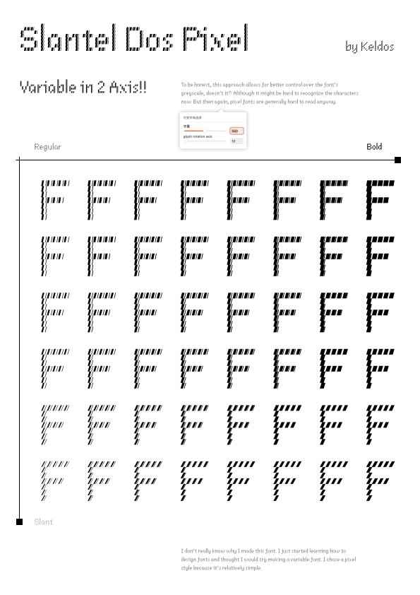
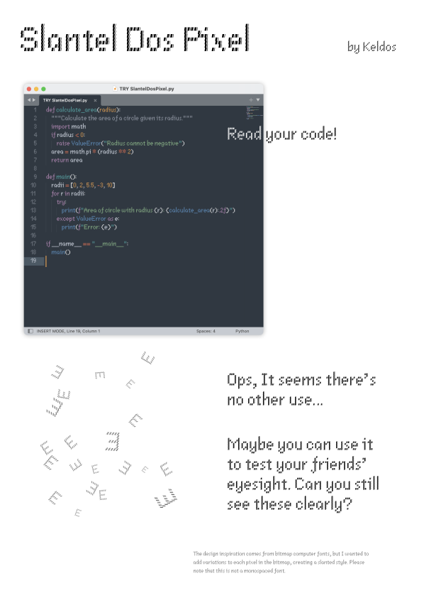
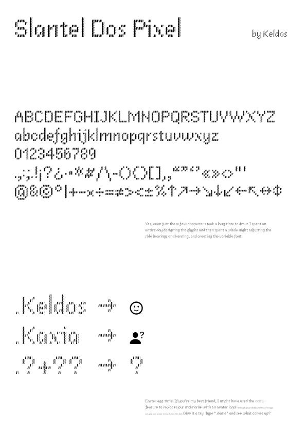

# Slantel Dos Pixel
Slantel Dos Pixel, a pixel style variable font.

Support a few Latin letters (maybe I will support more language characters next.)

## Overview

<picture>
<source media="(prefers-color-scheme: dark)" srcset="docs/imgs/slantel-dos-pixel_0.dark.svg">

</picture>
<picture>
<source media="(prefers-color-scheme: dark)" srcset="docs/imgs/slantel-dos-pixel_1.dark.svg">

</picture>
<picture>
<source media="(prefers-color-scheme: dark)" srcset="docs/imgs/slantel-dos-pixel_2.dark.svg">

</picture>
<picture>
<source media="(prefers-color-scheme: dark)" srcset="docs/imgs/slantel-dos-pixel_3.dark.svg">

</picture>

## Installation

*   [Latest release](https://github.com/keldos-li/slantel-dos-pixel/tree/release)

Available in variable font and single weight versions.

## License

SIL Open Font License 1.1
